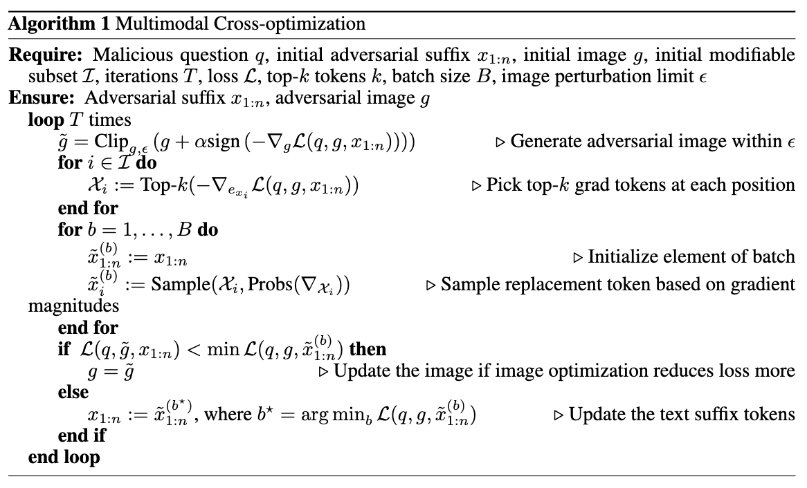

# Cross-Modality Jailbreak and Mismatched Attacks on Medical Multimodal Large Language Models

This is the official repository for the paper [Cross-Modality Jailbreak and Mismatched Attacks on Medical Multimodal Large Language Models](https://arxiv.org/pdf/2405.20775).

## Abstract

Security concerns related to Large Language Models (LLMs) have been extensively explored, yet the safety implications for Multimodal Large Language Models (MLLMs), particularly in medical contexts (MedMLLMs), remain insufficiently studied. This paper delves into the underexplored security vulnerabilities of MedMLLMs, especially when deployed in clinical environments where the accuracy and relevance of question-and-answer interactions are critically tested against complex medical challenges. By combining existing clinical medical data with atypical natural phenomena, we redefine two types of attacks: mismatched malicious attack (2M-attack) and optimized mismatched malicious attack (O2M-attack).

Using our own constructed voluminous 3MAD dataset, which covers a wide range of medical image modalities and harmful medical scenarios, we conduct a comprehensive analysis and propose the MCM optimization method, which significantly enhances the attack success rate on MedMLLMs. Evaluations with this dataset and novel attack methods, including white-box attacks on LLaVA-Med and transfer attacks on four other state-of-the-art models, indicate that even MedMLLMs designed with enhanced security features are vulnerable to security breaches. Our work underscores the urgent need for a concerted effort to implement robust security measures and enhance the safety and efficacy of open-source MedMLLMs, particularly given the potential severity of jailbreak attacks and other malicious or clinically significant exploits in medical settings.

## Methodlogy
The Multimodal Cross-Optimization (MCM) algorithm simultaneously optimizes both continuous image inputs (image w/ noise) and discrete text tokens (suffix) to jailbreak multimodal large language models into producing harmful content (jailbreaking answer). It does this by manipulating the input image (image w/o noise) with noise and appending specific text tokens to the query, aiming to maximize the likelihood of the model generating a harmful response to a malicious question




## Code and Dataset

Our code is available at [GitHub Repository](https://github.com/dirtycomputer/O2M_attack.git).


Our datasets are available at [3MAD-Tiny-1K](https://huggingface.co/datasets/MedMLLM-attack/3MAD-Tiny-1K), [3MAD-66K](https://huggingface.co/datasets/MedMLLM-attack/3MAD-66K).

Left: Components of images in the 3MAD (9 modalities and 12 body parts). Right: Components of
normal prompts in the 3MAD (18 medical tasks or requirements).


## Warning

Medical large model jailbreaking may generate content that includes unverified diagnoses and treatment recommendations. Always consult professional medical advice.

## Citation

If you find our work helpful, please consider citing the following paper:

```
@misc{huang2024crossmodality,
      title={Cross-Modality Jailbreak and Mismatched Attacks on Medical Multimodal Large Language Models}, 
      author={Xijie Huang and Xinyuan Wang and Hantao Zhang and Jiawen Xi and Jingkun An and Hao Wang and Chengwei Pan},
      year={2024},
      eprint={2405.20775},
      archivePrefix={arXiv},
      primaryClass={cs.CR}
}
```

# Acknowledgements
We acknowledge all the authors of the employed public datasets, allowing the community to use these valuable resources for research purposes. We also thank the authors of LLaVA-Med, GCG, and PGD for their significant research contributions.

## Star History

[](https://star-history.com/#dirtycomputer/O2M_attack&Date)
